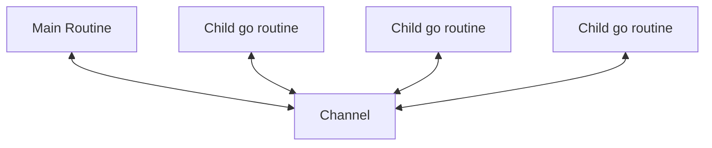

# Routines

A goroutine is a lightweight thread managed by the Go runtime.

Goroutines are functions that run concurrently with other functions.

* When one core - concurrency (multiple tasks in such a way that they appear to be running simultaneously, even if they
  are not necessarily running in parallel)
* When multiple CPU's - parallelism (multiple CPU cores to execute tasks at the same time)

Program has:

* Main Routine - main routine created when the program starts
* Child go routine - child routines created by the `go` keyword
* Child go routine
* Child go routine
* Child go routine

e.g.

```go
go doSomething()
```

Channels are used to communicate between routines (e.g. when the main routine should wait for the child routine).



* `channel <- "message ok"` - send "message ok" into channel
* `myMessage <- channel` - wait for assign value to myMessage from channel
* `fmt.Println(<-channel)` - wait for value from channel

e.g.:

* [010-routine-and-channel](../samples/010-routine-and-channel)
